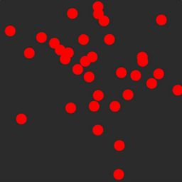

# WebRTC Contact Demo

A demo using React and WebRTC to stream animations from a server.



## Getting Started

```bash
yarn
yarn start
```

The React app should open. You might need to refresh it or the server to get it
running properly - the WebRTC connection is finickey.

## What's next

- Make the connection more stable
- Support multiple WebRTC connections
- Find ways to compress/optimize the data going over the wire
- Set up client-side simulation and interpolation of server data
